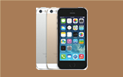

# PC-Demo
a PC-Demo
做完这个小项目大概前后花了3天的时间，中间其实还遇到蛮多问题的，现在来总结下问题的出现和解决方法，以及获得的经验。
最终效果图为:

####   问题1：img与h4之间的文字有间隙？
    在
    <ul class="list">
                 <li>
                
               <h4 class="caption">iphone  5s</h4>
             </li>
    <ul>
中如果默认的话img 和 h4的文字之间是有间隙的，如图所示：
answer:为了消除这种间隙，在相应的css里面设置这样：
.list li img{
    width: 158px;
    height:140px;
    display: block;/*消除了图片元素与h4之间的间隙*/
}
则设置之后就会变成这样：如图所示：

####   问题2：初期在做的时候对于每个元素设置了很多的margin属性才让它们居中，但是又会随着浏览器窗口大小的改变而改变？
answer:因为对于顶层的div容器以及背景图的position没有设置好，再加上对于内部的div,如果想让它不随浏览器窗口大小的改变而变化而且处于居中的位置话，就要这样设置：
  假设
        `
`
            `
111`
                   `
222
`
                `
`
         `
`
    则为其设置这样的属性之后就会满足要求了：
    
样子如图所示：

####   问题3：如何让p文字和div处于同一行？
answer:设置div和p都为float:left;然后具体的再调整margin值，使它们对齐
eg:
   `
hello!

my first job~
`
   样式为:
   #first{
        float: left;
        margin-top:16px;
    }
    p{
        float: left;
    }
    此时可以让它们对齐，如图所示：

####   问题4：如何让两个div 并行对齐处于同一行？
answer:对于2个div要设置float:left;属性
    eg:     
      `
我是第一个box
`
       `
我是第二个box
`
样式：
.board{
        width: 300px;
        height:300px;
        float: left;/*重点是设置这个*/
    }
.b1{
        background-color: blue;
    }
.b2{
        background-color: purple;
    }
如图所示：

####   问题5：jQuery如何实现排行榜间歇滚动？
answer:
<!-- 排行榜 -->
    

       

           <dl> <!-- 设置样式overflow:hidden;使得滚动上去的li隐藏 -->
           <dd>幸运用户</dd>
           <dd>获奖时间</dd>
           <dd>奖品</dd>
           </dl>
       
 <!-- 设置样式overflow:hidden;使得滚动上去的li隐藏 -->
           <ul>
               <li>
                   
布袋A咔咔

                   
2016-06-08

                   
iPhone 5s

               </li>

               <li>
                   
爱吃手指

                   
2016-06-08

                   
30元话费充值卡

               </li>

               <li>
                   
怪蜀黍

                   
2016-06-08

                   
小熊抱枕

               </li>

                <li>
                   
推不倒的大熊

                   
2016-06-08

                   
蓝牙耳机

               </li>
            </ul>
        

    

jQuery代码为:
        `function autoscroll(obj){
            $(obj).find("ul").animate({
              margin-top:-36px //这里的数值要跟ul li的高度一致
            },500,function(){
              $(this).css({margin-top:'0px'}).find("li:first").appendTo(this);//将每次向上滚动的li元素设置为距顶部设为为0px;且作为li的首元素
              $(this).find("li:first div").addClass('highlight');//找到每次向上滚动的第一个li下的所有div,加高亮效果
            }).find("li:first div").removeClass('highlight');////每执行完一次就清除高亮
        }`

       `// 设置一定的间隔自动滚动
        $(function(){
            setInterval('autoScroll(".maquee")',3000);
        })`

问题6：点击prev,next按钮图片向后向前滚动？
answer:锋利的jquery有实例代码。

总之，在页面布局的position设置，jquery实现一些负责的动效还做得不是很好。。还得继续继续学习加油啊！！
